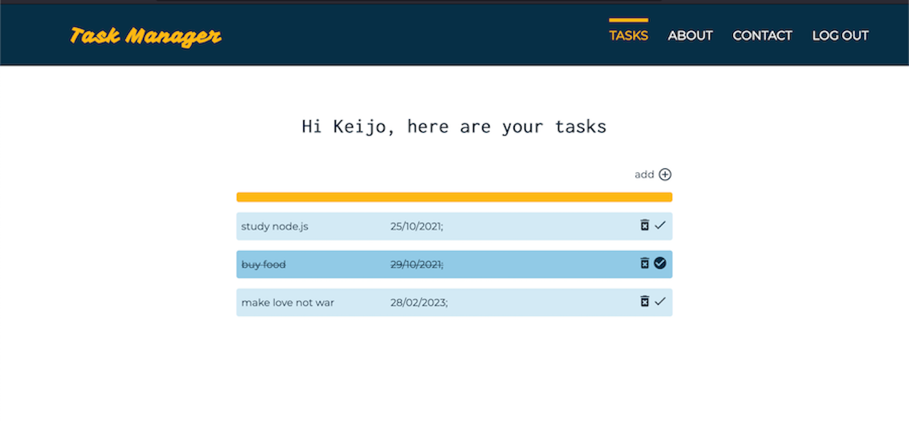

# Task Manager Application

This is a project for [Omnia](https://www.omnia.fi/en) web development course to demonstrate newly learned skills . 

## Table of contents

- [Overview](#overview)
  - [The challenge](#the-challenge)
  - [Screenshot](#screenshot)
  - [Links](#links)
- [My process](#my-process)
  - [Built with](#built-with)
  - [Deployed with](#deployed-with)
  - [What I learned](#what-i-learned)
  - [Continued development](#continued-development)
  - [Useful resources](#useful-resources)
- [Author](#author)
- [Acknowledgments](#acknowledgments)

## Overview

### The challenge

Build an application that features the following:

- Dynamic content (database)
- CRUD operations
- User authentication
- Responsive layout
- Mobile first design

### Screenshot

### Links

- Live Site URL: [Running on Heroku](https://omnia-task-manager.herokuapp.com/)

## My process

### Built with

- Semantic HTML5 markup
- CSS custom properties
- Flexbox
- Mobile-first workflow
- Responsive layout
- [EJS](https://ejs.co/) - Embedded JS templating
- [Node.js](https://nodejs.org/en/) - JS runtime 
- [Express.js](https://expressjs.com/) - Node web framework
- [Passport.js](https://www.passportjs.org/) - Authentication middleware for Node/Express web apps
- [MySQL](https://dev.mysql.com/) -  Relational database management system   
   
### Deployed with   

- [Heroku](https://www.heroku.com/) - Cloud platform, PaaS
- [JawsDB MySQL](https://devcenter.heroku.com/articles/jawsdb) - Heroku add-on for MySQL database

### What I learned

During this project I have been able to develop new and existing core skills:
- use of SQL database in Node/Express application
- conceptual understanding of Express framework and middleware
- http protocol  
- user authentication with Passport.js local strategy with sessions
- password reset flow with e-mail and token
  

### Continued development

In future projects I plan to dive deeper into REST API design conventions and patterns, get skilled on MERN stack and implement more complex user authentication strategies.   

### Useful resources

- [Coding Addict](https://www.youtube.com/watch?v=TNV0_7QRDwY) - Node Express fundamentals
- [freeCodeCamp](https://www.youtube.com/watch?v=F-sFp_AvHc8) - This thorough video tutorial helped me to understand Passport.js local strategy and the underlying logic and flow based on sessions and cookies.

**Note: Delete this note and replace the list above with resources that helped you during the challenge. These could come in handy for anyone viewing your solution or for yourself when you look back on this project in the future.**

## Author

- Website - [Add your name here](https://www.your-site.com)
- Frontend Mentor - [@yourusername](https://www.frontendmentor.io/profile/yourusername)
- Twitter - [@yourusername](https://www.twitter.com/yourusername)

**Note: Delete this note and add/remove/edit lines above based on what links you'd like to share.**

## Acknowledgments

This is where you can give a hat tip to anyone who helped you out on this project. Perhaps you worked in a team or got some inspiration from someone else's solution. This is the perfect place to give them some credit.

**Note: Delete this note and edit this section's content as necessary. If you completed this challenge by yourself, feel free to delete this section entirely.**
